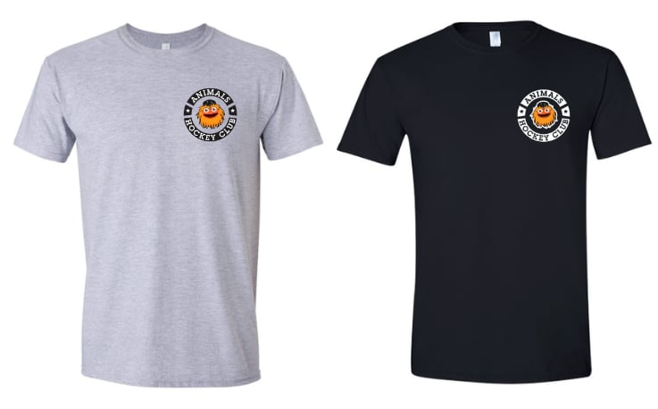
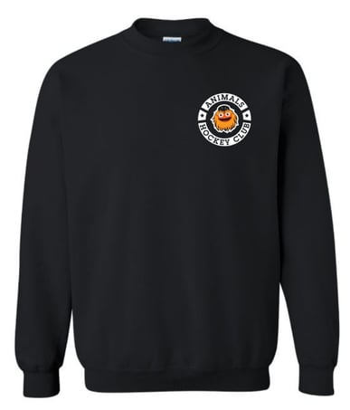
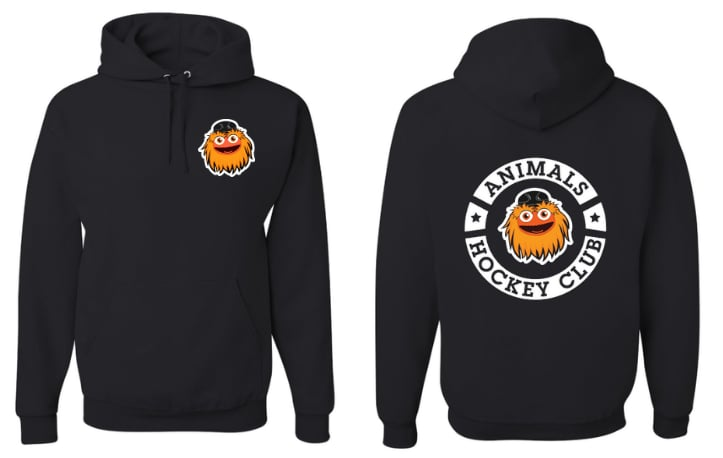

Animals Hockey Club come get your shirts to support the team!

<!--more-->

## T-Shirt 
Unisex soft cotton T-shirt in Grey or Black with the [Animals Hockey Club](https://www.instagram.com/animalshockeyclub/) logo on the left chest.  Adult & youth sizes available.

## Sweatshirt
Shown above, unisex heavy cotton crewneck sweatshirt.  Black with the [Animals Hockey Club](https://www.instagram.com/animalshockeyclub/) logo on the left chest.  Adult & youth sizes available.

## Hoodies
Unisex heavy cotton hoodie in Black.  [Animals Hockey Club](https://www.instagram.com/animalshockeyclub/) Logo on the left chest and centered on the back.  Adult & youth sizes available.

<h2 id="order_now"> Order Now!</h2>
<form action="https://www.paypal.com/cgi-bin/webscr" method="post" target="_top">
  <input type="hidden" name="cmd" value="_s-xclick" />
  <input type="hidden" id="hosted_button_id" name="hosted_button_id" value="A2BTZSU4V56LU" />
  <table class="not-prose">
    <tr>
      <td>
        <input type="hidden" name="on0" value="Style"/>
        <strong>Style</strong>
      </td>
    </tr>
    <tr>
      <td>
        <select id="os0" name="os0" class="input input-bordered" style="appearance:auto; -webkit-appearance: auto" onChange="updateItemName()">
          <option value="Youth T-Shirt">
            Youth T-Shirt $25.00 CAD
          </option>
          <option value="Youth Crewneck">
            Youth Crewneck Sweatshirt $40.00 CAD
          </option>
          <option value="outh Hoodie">
            Youth Hoodie $45.00 CAD
          </option>
           <option value="Adult T-Shirt">
            Adult T-Shirt $25.00 CAD
          </option>
          <option value="Adult Crewneck">
            Adult Crewneck Sweatshirt $40.00 CAD
          </option>
          <option value="Adult Hoodie">
            Adult Hoodie $45.00 CAD
          </option>
        </select>
      </td>
    </tr>
    <tr>
      <td style="padding-top:10px">
        <input type="hidden" name="on1" value="Size"/>
        <strong>Size</strong> (see <a target="_blank" style="color:#22c;" href="/sizing-chart/">Sizing Chart</a>)
      </td>
    </tr>
    <tr>
      <td>
        <select id="os1" name="os1" class="input input-bordered" style="appearance:auto; -webkit-appearance: auto" onChange="updateItemName()">
          <option value="XS">
            XS - T-shirt only
          </option>
          <option value="Small" selected>
            Small
          </option>
          <option value="Medium">
            Medium
          </option>
          <option value="Large">
            Large
          </option>
          <option value="XL">
            XL
          </option>
          <option value="2XL">
            2XL
          </option>
          <option value="3XL">
            3XL
          </option>
        </select>
      </td>
    </tr>
    <tr>
      <td style="padding-top:10px">
        <input type="hidden" name="on2" value="Color"/>
        <strong>Color</strong>
      </td>
    </tr>
    <tr>
      <td>
        <select id="os2" name="os2" class="input input-bordered" style="appearance:auto; -webkit-appearance: auto" onChange="updateItemName()">
          <option value="Black" selected>
            Black
          </option>
          <option value="Grey" >
            Grey (T-shirt only)
          </option>
        </select>
      </td>
    </tr>
    <tr>
      <td style="padding-top:10px">
        <input type="hidden" name="on3" value="Customizations and Notes"/>
      <strong>Customizations and Notes</strong>
      </td>
    </tr>
    <tr>
      <td>
        <input type="text" name="os3" style="border-width:1px" maxLength="500" class="input input-bordered"/>
      </td>
    </tr>
    <tr>
      <td style="padding-top:10px">
        <input type="checkbox" name="local-pickup" onClick="toggleLocalPickup()"/> I'll pickup this order myself (no shipping applied)
        <input type="hidden" id="no_shipping" name="no_shipping" value=2 />
      </td>
    </tr>

  </table>
  <input type="hidden" id ="item_name" name="item_name" value="Animals Hockey">
  <input type="hidden" id ="os4" name="os4" value="HAnimals Hockey">
  <input type="hidden" name="currency_code" value="CAD" />
  <input style="margin-top:10px" type="image" src="https://www.paypalobjects.com/en_US/i/btn/btn_buynowCC_LG.gif" border="0" name="submit" title="PayPal - The safer, easier way to pay online!" alt="Buy Now" onClick="updateItemName()"/>
  </form>
  
Shipping Costs Calculated at Checkout

  
